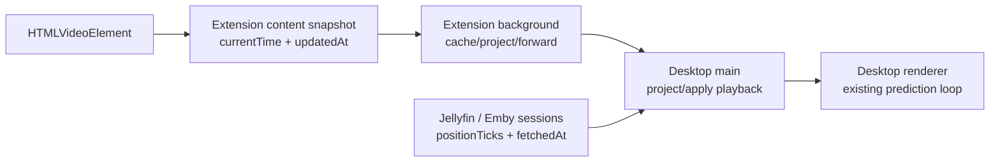

# Playback Time Baseline Design

## Goal

Restore accurate playback synchronization across the browser extension, the desktop app, and the built-in Jellyfin / Emby media source by making playback sample time a single shared contract.

The final behavior is:

- A playback snapshot's `currentTime` is always interpreted relative to its `updatedAt` sample timestamp.
- Any runtime that forwards, caches, replays, or applies a playback snapshot projects it to the local handling time before exposing it further.
- The desktop renderer receives a correct `currentTime` plus `lastUpdate` baseline and keeps using the existing renderer prediction loop.

## Scope

This design covers only playback time baseline synchronization.

In scope:

- Browser extension content-to-background media snapshots.
- Browser extension reconnect synchronization to desktop WebSocket endpoints.
- Browser extension popup/dashboard media snapshot display.
- Desktop main process handling of extension playback messages.
- Desktop main process handling of built-in Jellyfin / Emby playback snapshots.
- Shared contracts-level playback projection utilities and tests.

Out of scope:

- Restoring the removed dynamic plugin system.
- Restoring `plugins/`, `plugin-repository/`, plugin manifests, plugin sandboxing, plugin catalog, or plugin package installation code.
- Compatibility layers, legacy fallback paths, or migration logic for removed plugin-era data. The project has not launched, so only the final current shape is supported.
- Rewriting renderer playback prediction or transcript auto-follow behavior.

## Final Architecture

`packages/contracts/src/core/playback.ts` owns the playback projection rule. Both app surfaces import the same functions instead of duplicating timestamp math.

The shared contract treats these values as distinct:

- `updatedAt`: the timestamp at which `currentTime` was sampled.
- `currentTime`: media position, in milliseconds, at `updatedAt`.
- `playbackRate`: playback speed reported by the source.
- `paused`: whether the source was paused at `updatedAt`.
- `lastUpdate`: desktop renderer baseline timestamp after the main process has projected a source snapshot to desktop handling time.

The final data flow is:



## Shared Playback Projection

The contracts package exposes a small, deterministic playback-time API.

Final API shape:

```ts
export interface PlaybackProjectionInput {
  currentTime: unknown;
  updatedAt: unknown;
  playbackRate: unknown;
  paused: unknown;
  duration?: unknown;
}

export interface PlaybackProjection {
  currentTime: number;
  updatedAt: number;
  playbackRate: number;
}

export function projectPlaybackSnapshot(input: PlaybackProjectionInput, now?: number): PlaybackProjection;
```

Rules:

- `updatedAt` is the source sample timestamp. If it is not a finite positive number, `now` is used as the sample timestamp.
- `currentTime` is normalized to a finite non-negative millisecond value.
- `paused === true` produces `playbackRate: 0` and does not advance `currentTime`.
- Playing snapshots use `currentTime + max(0, now - updatedAt) * playbackRate`.
- Invalid playing rates normalize to `1`.
- Invalid paused rates normalize to `0`.
- Negative elapsed time is clamped to `0`.
- If `duration` is a finite positive number, projected `currentTime` is clamped to `[0, duration]`.
- Without a valid positive duration, projected `currentTime` is clamped only to `>= 0`.
- The returned `updatedAt` is always the projection target time `now`.

`sentAt` remains a transport-envelope timestamp. It is not the playback sample timestamp and does not replace `updatedAt`.

## Browser Extension Final Shape

The content script remains the real media sampling source.

`gatherVideoState()` continues to read from `HTMLVideoElement` and emits:

- `currentTime` in milliseconds.
- `duration` in milliseconds or `null`.
- `playbackRate`.
- `paused`.
- `updatedAt: Date.now()`.
- existing loop metadata.

The background runtime owns cached and replayed media snapshots.

`MediaStateStore` stores records whose playback fields have a current background-side baseline. When a new content snapshot arrives, the store normalizes it through the shared projection rule using the background handling time.

`SnapshotBuilder` uses the shared projection rule when building popup/dashboard media info. The popup sees a current estimated media position, not a stale cached sample.

`sendCurrentMediaContext()` uses the shared projection rule before sending a cached `video-context` after reconnect. Reconnect sync sends a fresh projected snapshot with `updatedAt` set to the send time.

## Desktop Main Final Shape

`StateManager.updatePlayback()` accepts a playback patch whose `lastUpdate` may already be set by the caller. If no explicit `lastUpdate` is supplied, it uses `Date.now()`.

`connectionManager` handles extension playback messages as source snapshots:

- `video-context`.
- `time-update`.
- `playback-rate`.

For these messages, the main process projects `message.payload` through the shared contracts function at desktop handling time and writes:

- projected `currentTime`.
- projected `playbackRate`.
- normalized `duration`.
- existing `loop` metadata.
- `lastUpdate` equal to the projection target time.

The renderer keeps the existing `usePlaybackPrediction()` behavior. It does not need to know whether the source was the extension, reconnect replay, or Jellyfin / Emby. It only consumes a correct desktop baseline.

## Jellyfin / Emby Final Shape

The built-in Jellyfin / Emby media source treats server session positions as sampled playback snapshots.

Final session cache shape:

- Cached sessions are stored with `fetchedAt`.
- A session's `positionTicks` is interpreted as the position at `fetchedAt`.
- Cache hits retain the original `fetchedAt`; they are not treated as newly sampled positions.

Final playback event shape:

```ts
{
  type: "playbackSnapshot",
  sessionId: string | null,
  positionMs: number | null,
  durationMs: number | null,
  playbackRate: number,
  paused: boolean,
  updatedAt: number
}
```

`MediaSourceController` applies Jellyfin / Emby playback events through the shared projection rule. Playing sessions advance according to `Date.now() - updatedAt`; paused sessions do not advance.

## Error Handling

Invalid or incomplete playback timestamps must fail closed into a stable baseline rather than creating drift.

- Missing or invalid `updatedAt` becomes the local handling time.
- Missing or invalid `currentTime` becomes `0`.
- Missing or invalid duration means no upper clamp is applied.
- Missing or invalid playing `playbackRate` becomes `1`.
- Paused playback always uses effective rate `0`.
- Future `updatedAt` values do not rewind playback because elapsed time is clamped to `0`.
- Loop metadata is passed through unchanged. Projection only owns timeline position and rate.

## Tests And Acceptance Criteria

Required final tests:

- Contracts tests cover playing projection, paused projection, negative elapsed clamp, duration clamp, and invalid input normalization.
- Extension reconnect tests prove playing cached snapshots are projected before replay and paused cached snapshots are not advanced.
- Extension popup/snapshot tests prove media info uses projected current time.
- Extension media state tests prove stored records preserve a current `updatedAt` baseline.
- Desktop connection tests prove extension `time-update` and `video-context` messages with older `updatedAt` are projected before entering `PlaybackState`.
- Desktop state tests prove explicit `lastUpdate` is preserved and omitted `lastUpdate` still uses local time.
- Desktop media source controller tests prove `playbackSnapshot.updatedAt` is projected before updating playback state.
- Jellyfin / Emby media source tests prove session cache hits keep `fetchedAt` semantics: playing sessions advance, paused sessions do not.

Acceptance criteria:

- All playback sources use the contracts-level projection function.
- No dynamic plugin framework files or plugin-era runtime concepts are restored.
- No compatibility or migration code is added for old plugin-era data.
- The renderer prediction loop remains structurally unchanged and receives corrected `currentTime` / `lastUpdate` baselines.
- Focused extension, desktop main, and contracts tests pass.
- Extension and desktop typechecks pass.
