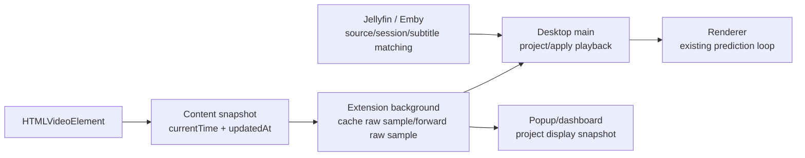

# Playback Time Baseline Design

## Goal

Playback time has one authoritative sample source: the browser extension's `HTMLVideoElement` snapshot. Desktop main is the only runtime that projects desktop-bound playback samples from their `updatedAt` sample timestamp to the local handling time. Extension background projection is limited to popup/dashboard display snapshots.

The desktop renderer keeps its existing prediction loop. It receives a desktop-side baseline containing projected `currentTime`, `playbackRate`, `duration`, `loop`, and `lastUpdate`.

## Final Architecture

`packages/contracts/src/core/playback.ts` owns the shared projection rule through `projectPlaybackSnapshot()`.
The helper accepts only complete, finite playback samples and rejects malformed input instead of fabricating timestamps or playback defaults.

The projection contract treats these values as distinct:

- `updatedAt`: when `currentTime` was sampled from the media element.
- `currentTime`: media position in milliseconds at `updatedAt`.
- `playbackRate`: source playback speed, or `0` for a paused effective-rate sample.
- `paused`: whether the source was paused at `updatedAt`.
- `duration`: source duration at `updatedAt`, or `null` when the media element has no finite duration.
- `lastUpdate`: desktop renderer baseline time after projection in the main process.

`sentAt` remains a transport timestamp. It is not a playback sample timestamp.

## Data Flow

## Extension

The content script reads playback directly from `HTMLVideoElement` and emits:

- `currentTime` in milliseconds.
- `duration` in milliseconds or `null`.
- `playbackRate`.
- `paused`.
- `updatedAt: Date.now()`.
- loop metadata.

The background runtime accepts only complete playback samples with a positive finite `updatedAt`. It rejects malformed playback samples instead of substituting a local timestamp. Cached media records keep the raw content sample. Desktop-bound broadcasts and reconnect replay forward that raw sample; popup/dashboard snapshots may call `projectPlaybackSnapshot()` for display only.

## Desktop Main

`ConnectionManager` projects all extension playback-bearing messages:

- `video-context`.
- `time-update`.
- `playback-rate`.

That projection happens once at desktop socket ingress, before either the generic/YT-DLP subtitle path or media-source handlers run.
`video-context` also updates the active tab/page context at socket ingress so immediate follow-up `time-update` or `playback-rate` messages from the same tab are not filtered while an async media-source match is still in flight.

For Jellyfin / Emby videos, `MediaSourceController` may mark the message handled to prevent generic subtitle loading. It does not own playback projection; by the time it handles the message, `ConnectionManager` has already applied the same extension playback projection used by generic/YT-DLP playback.

## Jellyfin / Emby

The built-in Jellyfin / Emby media source is not a playback-time source.

It owns only:

- Matching configured server URLs.
- Fetching server sessions for session selection.
- Loading subtitle tracks from the selected session.
- Keeping first-match failures on the media-source path.

It does not emit playback timeline events. Server playback fields are not used to drive the desktop playback clock.

## Acceptance Criteria

- Desktop playback projection goes through `projectPlaybackSnapshot()` exactly once at desktop ingress. Popup/dashboard display projection may use the same helper without changing desktop-bound samples.
- Extension playback snapshots are the only playback timestamp source.
- Malformed playback samples are rejected instead of falling back to local timestamps or default playback values.
- Jellyfin / Emby media-source handling cannot fall through into generic subtitle loading, but it also cannot replace extension playback time.
- Media-source adapters do not own desktop playback timeline events.
- The renderer prediction loop remains structurally unchanged.
- Focused contracts, extension background, desktop main, typecheck, and repository tests pass.
