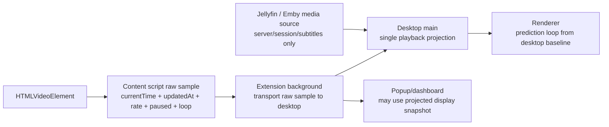

# Playback Clock and Media Source Separation Design

## Goal

Playback time has one runtime contract across generic/YT-DLP pages and Jellyfin / Emby pages:
the browser content script samples the active `HTMLVideoElement`, the extension transports that raw sample to the desktop app, and desktop main is the only runtime that projects the playback baseline consumed by the renderer.

Jellyfin / Emby media-source handling is limited to server matching, session identity, and subtitle loading. It must not create a second playback clock, rewrite desktop-bound playback samples, or generate routine renderer state churn during playback ticks.

This document supersedes the background/media-source portions of `2026-06-18-playback-time-baseline-design.md`. The project is not launched, so the final state does not include compatibility, migration, legacy data preservation, or fallback layers for older runtime behavior.

## Final State Summary

| Area | Current State | Final State |
| --- | --- | --- |
| Content playback sample | The content script reads `currentTime`, `playbackRate`, `paused`, `duration`, `updatedAt`, and loop metadata from `HTMLVideoElement`. | Keep this as the only playback sample source for all sites, including Jellyfin / Emby. |
| Desktop-bound extension broadcast | Extension background stores media state, projects it to a background-local baseline, and broadcasts the projected state to desktop. `SnapshotBuilder` can project again before forwarding. | Desktop-bound `video-context`, `time-update`, and `playback-rate` messages carry the raw content-script sample. Extension background may project only for popup/dashboard display, not for messages sent to desktop. |
| Desktop playback projection | `ConnectionManager` projects extension playback-bearing messages and applies playback before generic subtitle loading or media-source handlers run. | Keep desktop main as the single desktop playback projection owner. Every renderer playback baseline comes from this path. |
| Background cached media state | Cached media state is useful for popup display and reconnect sync, but it can currently become part of the desktop playback clock. | Cached media state is a dashboard/reconnect convenience only. Reconnect sync sends the latest raw sample shape or an explicitly documented raw-sample-equivalent snapshot, then desktop projects it once. |
| Jellyfin / Emby `time-update` handling | `JellyfinEmbyMediaSource` handles `time-update` / `playback-rate`, may refresh sessions, and can cause `state:changed` while normal playback ticks are flowing. | Ordinary `time-update` / `playback-rate` messages do not update media-source UI state and do not emit `sessionsChanged`. They are playback-clock messages, not session-refresh triggers. |
| Jellyfin / Emby `video-context` handling | Repeated `video-context` can run `sourceMatched`, reset subtitle state, set loading state, and reload subtitles even when the same server/session/item/tracks are already active. | Repeated `video-context` for the same server/session/item/subtitle-stream identity is idempotent. It does not reset subtitle state, enter loading, or reload tracks unless media identity or subtitle identity changes. |
| Session list updates | `setMediaServerSessions()` emits full `state:changed` whenever called, even when the session summary is unchanged. | Session summaries are compared by stable identity and relevant display fields. Unchanged session snapshots do not emit full state updates. |
| Subtitle track updates | Reloaded Jellyfin / Emby tracks can replace arrays and selected track objects even when the subtitle identity is unchanged. | Existing subtitle tracks and selections are preserved when track identity and cue boundaries are unchanged. New track objects are applied only for real subtitle identity or content changes. |
| Renderer playback input | Renderer receives focused playback updates and full desktop state updates. Full state updates can replace `store.playback` and restart prediction. | Non-playback full state changes do not replace the renderer playback baseline unless the playback value actually changed. Playback prediction is driven by `state:playback` or an equivalent changed playback payload only. |
| Loop state clearing | Non-loop playback messages can carry `loop: null` and overwrite desktop loop state. | Loop state changes are explicit. `loop-cleared`, `video-ended`, and direct playback control actions can clear loop state; ordinary playback samples do not clear loop state by omission. |
| Documentation contract | Older docs allow ambiguity around background projection and media-source playback participation. | Docs state that `/Sessions` playback fields and extension background projections are not desktop playback clocks. Media-source adapters cannot own playback timeline events. |

## Final Data Flow

## Component Contracts

| Component | Final Responsibility | Explicit Non-Responsibility |
| --- | --- | --- |
| `apps/extension/src/video/VideoStateGatherer.ts` | Sample the active `HTMLVideoElement` and attach `updatedAt` at sample time. | It does not compensate for transport latency beyond including `updatedAt`. |
| `apps/extension/src/background/messaging/ContentMessageRouter.ts` | Validate and forward accepted content messages to desktop connections with raw playback sample fields intact. | It does not project desktop-bound playback samples. |
| `apps/extension/src/background/tabs/MediaStateStore.ts` | Keep the latest media state for popup/dashboard, reconnect, and active-media selection. | It is not the owner of the desktop playback clock. |
| `apps/extension/src/background/messaging/SnapshotBuilder.ts` | Build projected display snapshots for popup/dashboard surfaces. | It does not transform desktop-bound playback messages. |
| `apps/desktop-app/src/main/connectionManager.ts` | Project every desktop-bound playback sample once, apply the result to `StateManager.updatePlayback()`, and keep active tab context current before media-source handlers run. | It does not use Jellyfin / Emby server playback fields as a clock. |
| `apps/desktop-app/src/main/features/jellyfinEmbyMediaSource.ts` | Match configured server URLs, select the server session, and load subtitle tracks for the selected media identity. | It does not emit or mutate playback timeline state for ordinary playback ticks. |
| `apps/desktop-app/src/main/mediaSources/mediaSourceController.ts` | Apply idempotent media-source identity, session, and subtitle events to desktop state. | It does not reset subtitle state for unchanged media identity or unchanged subtitles. |
| `apps/desktop-app/src/main/stateManager.ts` | Emit full state only when non-playback state materially changes and emit playback through the focused playback channel. | It does not emit full media-server state churn for unchanged session snapshots. |
| `apps/desktop-app/src/renderer/stores/desktop/actions/initActions.ts` | Merge renderer state updates without replacing an unchanged playback baseline. | It does not restart playback prediction for unrelated full-state updates. |
| `apps/desktop-app/src/renderer/components/subtitle/SubtitleView.vue` | Preserve local AB selection across playback ticks and unchanged media-source refreshes. | It does not treat same-subtitle object replacement as a user-visible subtitle switch. |

## Media Identity

Jellyfin / Emby media identity is the stable tuple used to decide whether media-source work is real or redundant:

| Field | Purpose |
| --- | --- |
| Server config ID and normalized server origin | Distinguishes configured Jellyfin / Emby servers. |
| Selected session ID | Identifies the active server playback session. |
| Now-playing item ID | Identifies the media item. |
| Media source ID | Identifies the media stream variant. |
| Subtitle stream indexes and display metadata | Identifies available subtitle sources. |

When this tuple is unchanged, repeated `video-context` messages are idempotent and do not reload subtitles. When any part changes, media-source state may reset and subtitles may reload because the user is on a different media identity.

## Subtitle Identity

Subtitle identity is based on track ID, source file label, cue count, and cue timing boundaries. Text changes in the same cue boundaries are treated as real content changes only when the loaded subtitle content differs.

Unchanged subtitle identity preserves:

- Selected primary and secondary track IDs.
- Existing track objects where practical.
- AB pending selection.
- Active loop metadata.
- Transcript scroll and prediction behavior tied to playback.

## Loop Contract

Ordinary playback samples report loop metadata when the content script has an active loop. They do not clear desktop loop state merely because `loop` is absent or `null`.

Loop state can be cleared only by explicit lifecycle events:

- `loop-cleared`.
- `video-ended`.
- User-initiated seek, pause, or play control when the control handler intentionally clears the loop.
- Media identity change that invalidates the loop cue range.

## Error Handling

| Scenario | Final Behavior |
| --- | --- |
| Malformed playback sample | Reject the sample at the receiving boundary and log the rejection. Do not fabricate local timestamps or default rates. |
| Jellyfin / Emby session request failure on initial match | Keep the failure on the media-source path and surface an error state. Do not fall through to generic/YT-DLP subtitle loading. |
| Jellyfin / Emby session request failure during ordinary playback tick | Do not interrupt playback projection or renderer prediction. Session refresh is not part of playback tick handling. |
| Subtitle request failure for changed media identity | Surface a media-source subtitle error for that identity. Do not preserve stale subtitles for a different media item. |
| Unchanged session or subtitle data | Do not emit full state changes and do not reset subtitle UI state. |

## Acceptance Criteria

| Requirement | Acceptance Criteria |
| --- | --- |
| Single desktop playback clock | Desktop main is the only runtime that projects desktop-bound playback samples. |
| ytdlp and Jellyfin / Emby parity | A `time-update` with the same raw sample produces the same desktop playback baseline regardless of whether the URL matches a media source. |
| No media-source playback clock | Jellyfin / Emby `/Sessions` playback fields are not read for desktop playback time. |
| No playback tick state churn | Jellyfin / Emby `time-update` / `playback-rate` does not emit `sessionsChanged`, full `state:changed`, subtitle reset, or subtitle reload. |
| Idempotent repeated context | Repeated `video-context` for the same media identity does not reset subtitles, clear AB pending selection, or enter loading state. |
| Explicit loop lifecycle | Ordinary playback samples do not clear loop state by omission. Only explicit loop lifecycle or invalidating media changes clear it. |
| Renderer prediction stability | Non-playback full-state updates do not restart prediction or replace the renderer playback baseline. |
| No compatibility layer | No migration, legacy fallback, or old-shape compatibility code is introduced. Existing pre-launch code is changed directly to the final contract. |

## Required Test Coverage

| Test Area | Required Coverage |
| --- | --- |
| Extension background forwarding | A desktop-bound `time-update` is broadcast with the same `currentTime`, `updatedAt`, `playbackRate`, `paused`, `duration`, and `loop` values sampled by content. |
| Extension dashboard projection | Popup/dashboard media snapshots can still show projected display time without mutating desktop-bound broadcasts. |
| Desktop projection parity | Generic and Jellyfin / Emby `time-update` messages with identical payloads produce identical `StateManager.updatePlayback()` calls. |
| Jellyfin / Emby tick handling | `time-update` / `playback-rate` for an active Jellyfin / Emby page does not fetch sessions and does not emit media-source state events. |
| Repeated Jellyfin / Emby context | Repeated `video-context` for unchanged media identity does not call subtitle reset or reload subtitle tracks. |
| Changed Jellyfin / Emby identity | A changed item/session/subtitle identity does update media-source state and reload subtitles. |
| Renderer stability | Full state updates with unchanged playback do not restart prediction or clear pending AB selection. |
| Loop lifecycle | `loop: null` on ordinary playback samples does not clear an existing desktop loop; `loop-cleared` still does. |

## Documentation Updates

The playback baseline documentation should state the final contract:

- Extension content samples are the only playback sample source.
- Extension background does not project desktop-bound playback messages.
- Desktop main owns the single renderer playback baseline.
- Jellyfin / Emby media-source code is metadata/session/subtitle handling only.
- `/Sessions` playback fields are outside the playback-time contract.
